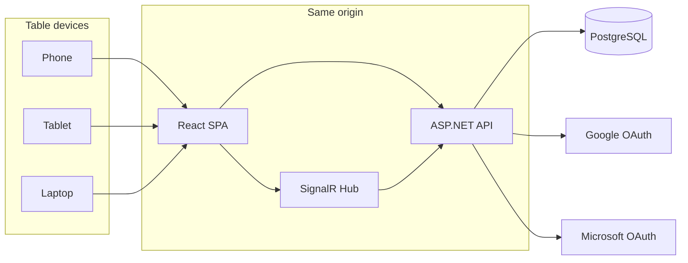
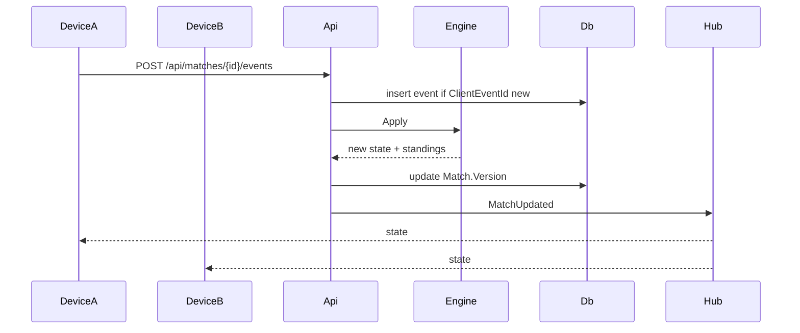

# ScoreForge Application Design

## Current starting point

The repo already has a useful skeleton (richest on `feat/phase2`; this work should continue on `react-new`):

- **API:** ASP.NET Core minimal APIs, cookie OAuth for Google and Microsoft, SQLite + EF Core, `GET /api/foundation/scoreboards`
- **Contracts:** event-sourced shapes (`Scoreboard`, `ScoreEvent`, `AppendScoreEventRequest` with `BaseVersion` + `ClientEventId`) that are not persisted yet
- **Client:** Blazor WASM PWA with an in-memory Cribbage pegboard and no Canasta UI

Treat `feat/phase2` as the behavioral reference. Replace [src/ScoreForge.Client](src/ScoreForge.Client) with a Vite React app. Keep and grow [src/ScoreForge.Api](src/ScoreForge.Api) and [src/ScoreForge.Contracts](src/ScoreForge.Contracts). Target **.NET 11 / `net11.0`** (matches [AGENTS.md](AGENTS.md) and the existing API).

## Recommended hosting default

Use a **same-origin** deploy so cookie auth stays simple:

- **Dev:** Docker Compose with PostgreSQL + API (`https://localhost:7016`) + Vite (`https://localhost:5173` proxied to the API)
- **Prod:** one ASP.NET container serves `/api`, SignalR, and the built SPA; **PostgreSQL** for the database
- **Later cloud:** Azure Container Apps + Azure Database for PostgreSQL (or any VPS). No Azure lock-in in v1

SQLite stays acceptable only for single-process local demos. Live multi-device writes need PostgreSQL.



## Product shape for v1

ScoreForge is a **scorekeeper**, not a digital card table. Players still play with real cards; every seated device shows the same match and can enter scores.

- Authenticated users only (Google or Microsoft)
- A match has seats (names) that logged-in users can claim
- Anyone at the table with the match URL can update scores; the server is the source of truth
- First-class games: **Cribbage** (port the pegboard) and **American Canasta** (round scoresheet)
- Other games later plug in as a new engine + UI pack, without a schema rewrite

### Cribbage

Port the existing board from [src/ScoreForge.Client/Pages/Cribbage.razor](src/ScoreForge.Client/Pages/Cribbage.razor):

- Default: 2 players, race to 121 (option: 61)
- Entry: +1/+2/+3/custom, tap a hole, undo
- Visual dual-lane pegboard (current + previous peg, skunk holes)
- Persist every scoring action as an event so a second phone tracks in real time

Hand-point calculators (fifteens, pairs, runs) can wait; v1 is the live pegboard.

### Canasta

American Canasta, not a card simulator:

- 2 players or 4 players in partnerships, game to 5000
- Round scoresheet per side: card points, natural/mixed canastas, red threes, going out, counts against
- Engine applies initial-meld thresholds from current score (50 / 90 / 120) as **guidance**, not as a rules referee
- Running totals, round history, and a winner banner at 5000

## Domain and persistence

Keep the append-only match model from [src/ScoreForge.Contracts/DomainModels.cs](src/ScoreForge.Contracts/DomainModels.cs), and actually persist it.

| Entity | Role |
|---|---|
| `User` | First login from OAuth (`sub` + issuer, display name, email) |
| `GameDefinition` | Catalog row: `cribbage`, `canasta` |
| `Match` | Owner, game, status, version, options JSON (win score, player count) |
| `MatchSeat` | Display name, team (Canasta), claimed `UserId` |
| `ScoreEvent` | Append-only: type, payload JSON, actor, `ClientEventId`, version |

EF Core + **migrations** (replace `EnsureCreatedAsync`). Npgsql in prod/dev compose; SQLite optional for unit tests.

### Game engines (server is authoritative)

```csharp
public interface IGameEngine
{
    string GameId { get; }
    GameState CreateInitialState(MatchOptions options, IReadOnlyList<Seat> seats);
    GameState Apply(GameState state, ScoreEventInput input); // validates + folds
    MatchStandings GetStandings(GameState state);
    bool IsComplete(GameState state);
}
```

- `ScoreForge.Games.Abstractions` — interface + shared value types
- `ScoreForge.Games.Cribbage` — peg positions, 121 cap, undo as compensating event
- `ScoreForge.Games.Canasta` — round fold, partnership totals, 5000 win

Event payloads stay game-specific JSON. The API stores them opaquely; only the engine interprets them. Adding Euchre later is a new project + React route, not new tables.



## API surface

Keep cookie auth from [src/ScoreForge.Api/Program.cs](src/ScoreForge.Api/Program.cs). Replace the foundation list with real match APIs.

**Auth (keep)**

- `GET /api/auth/providers`
- `GET /api/auth/login/{google|microsoft}?returnUrl=`
- `GET /api/auth/me`
- `POST /api/auth/logout`

**Matches**

- `GET /api/games` — cribbage, canasta
- `POST /api/matches` — create (gameId, seats, options)
- `GET /api/matches` — matches the user owns or has joined
- `GET /api/matches/{id}` — snapshot: seats, events, derived standings, version
- `POST /api/matches/{id}/seats/{seatId}/claim` — bind current user
- `POST /api/matches/{id}/events` — append (`ClientEventId`, `BaseVersion`, payload)
- `POST /api/matches/{id}/events/undo` — compensating event when legal

**Realtime**

- Hub `/hubs/match` — join group `match:{id}` after auth + membership check
- Server broadcasts `MatchUpdated` after a successful append

Concurrency: if `BaseVersion` is stale, return `409` with the latest snapshot; the client rebases and retries. Duplicate `ClientEventId` returns the existing result (idempotent).

On first OAuth success, upsert `User` from claims so matches have a real owner.

CSRF: same-origin in prod; require a custom header (e.g. `X-Requested-With`) on mutating API calls. Keep `SameSite=Lax`, `HttpOnly`, `Secure`.

## React client

New Vite + TypeScript app (replace Blazor):

- React Router
- Redux Toolkit + RTK Query for REST
- `@microsoft/signalr` feeding match-slice updates
- Tailwind CSS for chrome; keep a small CSS module for the Cribbage wood board (gradients/pegs do not map cleanly to utilities)
- `credentials: 'include'` on all API calls (same cookie session as today)

**Routes**

- `/login` — Google / Microsoft buttons (only show configured providers)
- `/` — match list + “New match”
- `/matches/new` — pick Cribbage or Canasta, seat names, options
- `/matches/:id` — live score UI for that game
- `/matches/:id/join` — claim a seat

**Redux shape**

```ts
auth: { user, providers, status }
matches: { list, status }
activeMatch: {
  id, gameId, version, seats, events, standings, connection
}
```

Game screens are presentational: they dispatch `appendEvent` / `undo`; derived scores come from the server snapshot (and optimistic local apply using the same event types).

Generate TypeScript types from OpenAPI (`NSwag` or `openapi-typescript`) instead of sharing C# with the SPA.

## Project layout

```
src/ScoreForge.Api/                 # host, auth, SignalR, EF, endpoints
src/ScoreForge.Contracts/           # HTTP DTOs
src/ScoreForge.Games.Abstractions/
src/ScoreForge.Games.Cribbage/
src/ScoreForge.Games.Canasta/
src/ScoreForge.Web/                 # Vite React + Redux + Tailwind
tests/ScoreForge.Api.Tests/
tests/ScoreForge.Games.Tests/       # engine unit tests (xUnit)
src/ScoreForge.Web/src/**/*.test.ts # Vitest + Testing Library
```

Drop template Blazor pages (Counter, Weather). Update [scripts/dev.ps1](scripts/dev.ps1) to run API + Vite. API in Production serves `wwwroot` from the Vite build.

## Testing and CI

Per [AGENTS.md](AGENTS.md):

- xUnit (+ Moq) for API, auth mapping, event append/idempotency/409, SignalR authorization, both game engines
- Vitest for Redux slices and score UI helpers; prompt for Playwright component/functional coverage of login, create match, two-tab live update
- GitHub Actions: `dotnet build`, `dotnet test`, `dotnet format --verify-no-changes`, `npm ci && npm test && npm run lint` (no CD/publish)
- Extend Dependabot to npm as well as NuGet

## Implementation sequence

1. **Scaffold** — React app, Tailwind, Redux, proxy, API serves SPA in prod; delete Blazor client
2. **Identity** — persist `User` on OAuth; keep Google/Microsoft cookie flow; login UI in React
3. **Match core** — PostgreSQL schema, engines interface, REST snapshot + append with versioning
4. **SignalR** — live `MatchUpdated`; two-browser test as the acceptance bar
5. **Cribbage UI** — port pegboard onto the match API
6. **Canasta UI** — new-match options + round scoresheet + running totals
7. **Polish** — match list, claim seats, undo, disconnect banner, README, CI

## Out of scope for v1

- Playing the actual card game in-browser
- Offline queue / PWA sync (IndexedDB exists in Blazor; defer until live sync is solid)
- Guest play without login
- Extra titles (Euchre, etc.) beyond the plugin seam
- Publishing / CD
