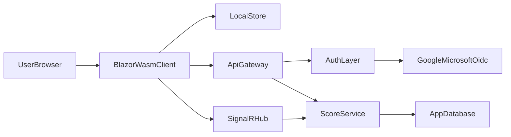

# Build Plan: Web-First Collaborative Score App

## Goals
- Deliver a **Blazor WebAssembly-first** application where scoring logic, UI behavior, and most state management run in the browser.
- Keep backend scope minimal: **Google/Microsoft auth**, user identity mapping, and persistent score/sync APIs.
- Support **real-time collaborative scoreboards** (multiple editors) with resilient offline-first behavior.

## Architecture Direction
- **Client**: Blazor WebAssembly PWA (local state, optimistic writes, offline queue).
- **Backend**: ASP.NET Core Minimal API for auth/session, scoreboard CRUD, and real-time hub.
- **Realtime**: SignalR hub for shared scoreboard updates.
- **Storage**: relational DB (PostgreSQL/SQL Server) with per-scoreboard versioning.
- **Auth**: OIDC social login (Google + Microsoft) via ASP.NET Core auth middleware and token/cookie flow suitable for SPA calls.

## Phased Delivery

### Phase 1: Foundation and App Skeleton
- Create solution layout for client/server/shared contracts.
- Add core entities: UserProfile, Game, Scoreboard, ScoreEvent, Participant.
- Set up shared DTO/contracts and validation used by both client and server.
- Enable PWA baseline and local persistence abstraction in client.

Proposed key files:
- [M:/repos/scoreforge/src/ScoreForge.Client/](M:/repos/scoreforge/src/ScoreForge.Client/)
- [M:/repos/scoreforge/src/ScoreForge.Api/](M:/repos/scoreforge/src/ScoreForge.Api/)
- [M:/repos/scoreforge/src/ScoreForge.Contracts/](M:/repos/scoreforge/src/ScoreForge.Contracts/)

### Phase 2: Auth (Google + Microsoft)
- Configure OIDC providers and identity mapping to internal user IDs.
- Implement login/logout/session endpoints usable from WASM app.
- Add route guards and authenticated API client setup.
- Add onboarding flow for first login and profile bootstrap.

### Phase 3: Scoreboard Domain + Persistence APIs
- Implement scoreboard APIs:
  - create/list/get/update scoreboards
  - add/update/remove participants
  - append score events and compute current totals
- Add ownership/collaborator permissions model.
- Add server-side concurrency token/version checks on write operations.

### Phase 4: Real-Time Collaboration
- Add SignalR hub for scoreboard channels.
- Broadcast score changes, participant updates, and metadata edits.
- Implement client reconciliation strategy for out-of-order events.
- Add presence indicators and basic conflict messaging.

### Phase 5: Offline-First + Sync Reliability
- Local-first writes in WASM (IndexedDB abstraction).
- Background sync queue with retry/backoff and idempotency keys.
- Conflict policy:
  - event-level append preferred over full document overwrite
  - version mismatch triggers lightweight merge/replay
- Explicit UI states for syncing, conflict, and offline mode.

### Phase 6: UX Hardening and Product Essentials
- Build fast score-entry interactions (hotkeys/buttons/swipe-friendly controls).
- Add game templates (e.g., darts, cards, board games) as optional presets.
- Add activity log/history and undo-last-action safeguards.
- Add responsive mobile-first layout and installable PWA prompts.

### Phase 7: Testing, CI, and Release Readiness
- Unit tests for score computation, permission checks, and sync conflict logic.
- Component tests for key scoring screens.
- Functional tests for auth + collaborative sessions.
- CI pipeline: build, test, lint, format verification.
- Performance pass on WASM payload size and startup path.

## Data + Sync Model (MVP)
- Use **event-sourced scoring actions** per scoreboard (append-only score events).
- Store scoreboard snapshot + latest version for fast reads.
- Client sends event with `clientEventId` and `baseVersion`.
- Server accepts/rejects based on version and returns authoritative version + computed totals.
- Realtime channel emits accepted events to all connected collaborators.

## Security and Access
- Every scoreboard has owner + collaborators.
- Access checks enforced in API and SignalR hub.
- Only authenticated users can create/edit scoreboards.
- Audit metadata on each score event: actor, timestamp, source device/session.

## MVP Exit Criteria
- User can sign in with Google/Microsoft.
- User can create a scoreboard and track scores locally immediately.
- Two users can edit the same scoreboard and see updates in near real-time.
- Offline edits are queued and later synchronized safely.
- Conflicts are handled predictably without silent data loss.

## Risks and Mitigations
- **Realtime conflict complexity**: favor append-only score events + version checks early.
- **Auth provider setup friction**: start with one provider first (Google), add Microsoft once flow is validated.
- **WASM startup size**: trim dependencies and lazy-load non-core UI features.